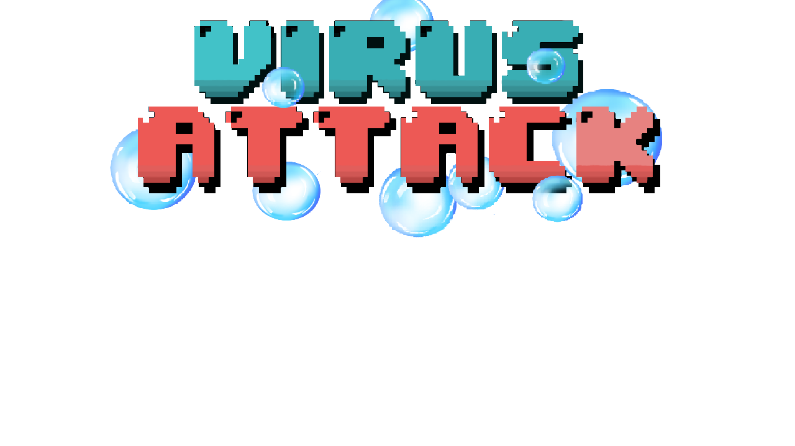
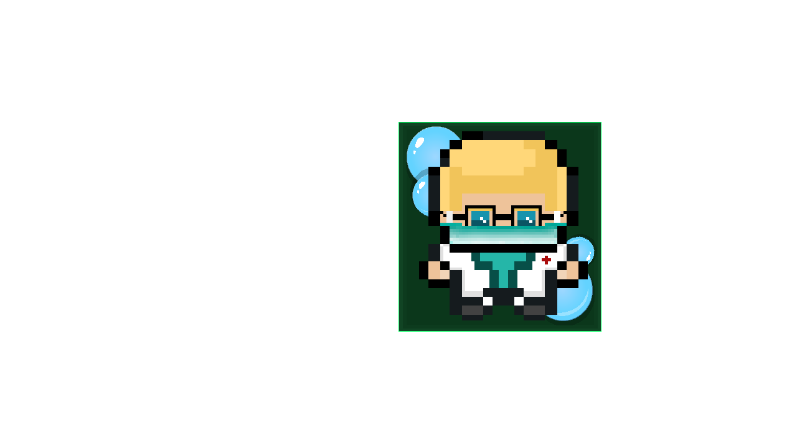
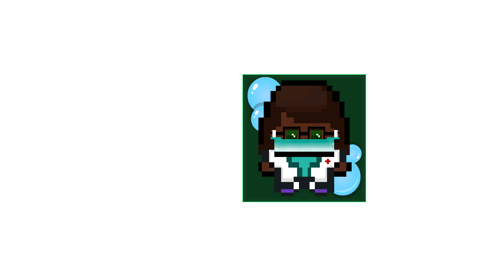
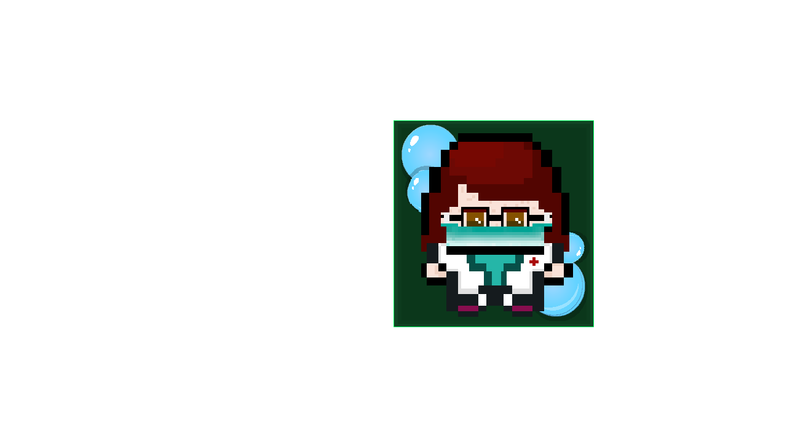
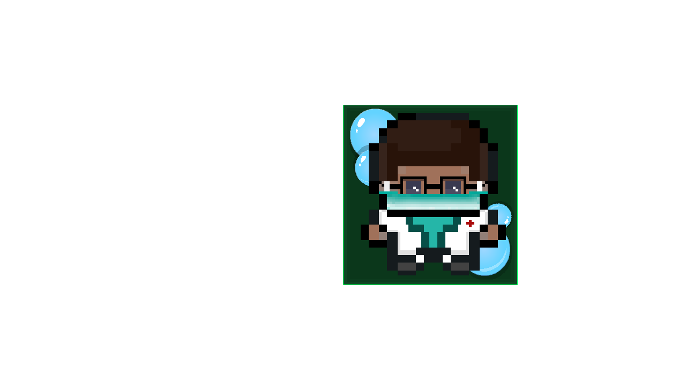
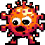
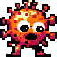
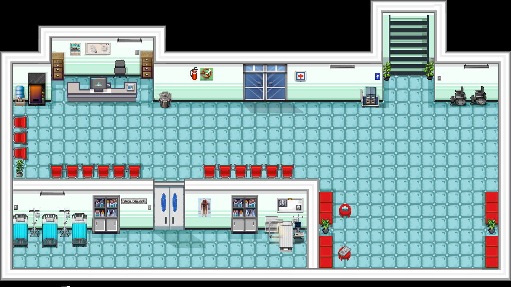

<div align="center">



# 🏥 VIRUS ATTACK
### *Defiende el hospital de virus y bacterias peligrosas*

[](LICENSE)
[](https://www.python.org/)
[](https://www.pygame.org/)

</div>

---

## 🎮 Galería Visual

### 👨‍⚕️ Elige tu Médico

<div align="center">

| Médico Rubio | Médica Morena |
|:---:|:---:|
|  |  |

| Médica Pelirroja | Médico Moreno |
|:---:|:---:|
|  |  |

</div>

### 🦠 Los Enemigos que Enfrentarás

<div align="center">

| Virus Tipo 1 | Virus Tipo 2 | Virus Tipo 3 | Virus Tipo 4 |
|:---:|:---:|:---:|:---:|
|  |  |  |  |

</div>

### 🎯 Niveles Progresivos

<div align="center">



**NIVEL 1** - El comienzo | **NIVEL 2** - Intensidad | **NIVEL 3** - ¡Al máximo!  
*+ Versiones avanzadas para los más valientes*

</div>

---

## 🎬 Gameplay en Acción

<div align="center">


> **Captura tu propio gameplay:** Juega el juego, captura los momentos más épicos y reemplaza este GIF  
> Usa herramientas como [LICEcap](https://www.cockos.com/licecap/) o la grabación de pantalla nativa de tu SO

</div>

---

## 📖 ¿Qué es Virus Attack?

**Virus Attack** es un juego educativo e intenso desarrollado en **Python con Pygame**. Tu misión es simple pero desafiante:

🏥 **Protege el hospital** de oleadas de virus y bacterias peligrosas  
⏱️ **Sobrevive 100 segundos** en cada nivel para avanzar  
💪 **Elige tu personaje** - Cuatro médicos únicos listos para la batalla  
🎓 **Aprende sobre salud** mientras te diviertes defendiendo pacientes  

El juego combina **arcade action** con **conciencia sobre salud**, demostrando la importancia de proteger nuestros espacios médicos.

---

## ✨ Características Destacadas

- **⚔️ Gameplay Dinámico** - Acción rápida que te mantiene al borde del asiento
- **🎨 Gráficos Coloridos** - Sprites cuidadosamente diseñados de médicos y virus
- **🌍 Multiidioma** - Soporte en Español e Inglés (Mexican & US English)
- **🎵 Audio Inmersivo** - Música y efectos de sonido que potencian la experiencia
- **👥 4 Personajes Únicos** - Cada médico tiene su propio estilo
- **📈 3 Niveles + Modos Avanzados** - Progresión clara y desafíos crecientes
- **🎓 Educativo** - Conciencia sobre la importancia de la salud y el saneamiento
- **🏆 Sistema de Puntuación** - Compite contigo mismo y mejora tu record

---

## 🎮 Cómo Jugar

### Controles Básicos

| Acción | Tecla |
|:---:|:---:|
| **Movimiento Arriba** | W o ⬆️ |
| **Movimiento Abajo** | S o ⬇️ |
| **Movimiento Izquierda** | A o ⬅️ |
| **Movimiento Derecha** | D o ➡️ |
| **Pausa** | ESC o Click en botón |

### Objetivo Principal

```
┌─────────────────────────────────────────┐
│  SOBREVIVE 100 SEGUNDOS                 │
│                                         │
│  ✅ Evita los virus y bacterias        │
│  ✅ Recoge burbujas de jabón           │
│  ✅ Defiende a los pacientes           │
│  ✅ ¡Alcanza la victoria!              │
└─────────────────────────────────────────┘
```

### Modo de Dificultad

- **Principiante** - Enemigos más lentos, bueno para aprender
- **Normal** - El desafío balanceado que te mantiene activo
- **Avanzado** - Para los que quieren la máxima intensidad

---

## 📦 Instalación

### Requisitos Previos

- Python 3.11 o superior
- pip (incluido con Python)

### Pasos de Instalación

#### 1️⃣ Clona el Repositorio
```bash
git clone https://github.com/tu-usuario/Virus-Attack.git
cd Virus-Attack
```

#### 2️⃣ Instala Dependencias
```bash
pip install -r requirements.txt
```

#### 3️⃣ ¡Juega!
```bash
python main.py
```

**¡Eso es todo!** El juego se abrirá y estarás listo para defender el hospital.

---

## 🔧 Compilar Ejecutable (Opcional)

Si quieres compartir el juego sin que otros necesiten instalar Python:

```bash
# Instala PyInstaller
pip install PyInstaller

# Compila el ejecutable
python -m PyInstaller VirusAttack.spec --clean
```

**Ubicación del ejecutable:**
- 🪟 Windows: `dist/VirusAttack/VirusAttack.exe`
- 🍎 macOS: `dist/VirusAttack/VirusAttack`
- 🐧 Linux: `dist/VirusAttack/VirusAttack`

Alternativamente, usa **GitHub Actions** para compilar automáticamente en Windows, macOS y Linux. Revisa [.github/workflows/build.yml](.github/workflows/build.yml).

---

## 🎨 Recursos & Créditos

- **Desarrollo:** Game Development with Love ❤️
- **Engine:** Pygame 2.0
- **Sprites & Arte:** Diseño original personalizado
- **Sonidos:** Música y efectos de sonido seleccionados
- **Localización:** Equipo dedicado a la accesibilidad

---

## 📜 Licencia

Este proyecto está bajo la licencia **MIT**. Eres libre de:
- ✅ Usar el proyecto comercialmente
- ✅ Modificar el código
- ✅ Distribuir el software
- ✅ Usar de forma privada

Solo necesitas incluir una copia de la licencia. Para más detalles, lee [LICENSE](LICENSE).

---

## 🚀 ¿Qué Viene Después?

- 🎯 Más niveles y personajes
- 🌐 Soporte multijugador
- 🏅 Sistema de logros
- 📊 Tabla de puntuaciones global

---

<div align="center">

### Hecho con ❤️ en Python

**¡Descarga, juega y defiende el hospital!**

[⬇️ Descargar Ahora](#instalación) · [🐛 Reportar Bug](../../issues) · [💡 Sugerir Feature](../../issues)

</div>
